 

   

---

## 👋 About me

I'm a backend-focused engineer with **6+ years** of experience turning complex business problems into
fast, secure and maintainable systems. I lead the programming team at **Istanbul Care**, where I architect the
platform behind a network of medical-tourism clinic brands — and on the side I build SaaS products,
LLM agents and automation tools end to end.

- 🏥 **Now:** Programming Team Lead & Backend Developer at Istanbul Care — one headless CMS powering 9 clinic brands
- 🤖 **Building:** LLM agents with tool-use orchestration, undoable checkpoints, RAG and MCP servers
- 🧱 **I care about:** layered architecture, security-first defaults, observability and real test suites
- 💬 **Ask me about:** FastAPI, Django, Go, PostgreSQL, Redis, scraping & browser automation, payments
- 🌍 **Based in** Istanbul · speaks Persian, Turkish and English

## 🧰 Tech stack

<table>
  <tr>
    <td align="center" width="170"><b>Languages</b></td>
    <td></td>
  </tr>
  <tr>
    <td align="center"><b>Backend</b></td>
    <td></td>
  </tr>
  <tr>
    <td align="center"><b>Frontend & Mobile</b></td>
    <td></td>
  </tr>
  <tr>
    <td align="center"><b>Data</b></td>
    <td></td>
  </tr>
  <tr>
    <td align="center"><b>DevOps & Cloud</b></td>
    <td></td>
  </tr>
  <tr>
    <td align="center"><b>AI & Automation</b></td>
    <td>
      
      
      
      
      
      
      
    </td>
  </tr>
</table>

## 🚀 Featured work

<table>
  <tr>
    <td width="50%" valign="top">
      <h3>🏥 Istanbul Care Platform</h3>
      Headless CMS that runs the websites of <b>9 clinic brands</b> from one codebase — SEO engine,
      RAG chatbot on pgvector, AI translation and zero-downtime blue-green deploys.
        
      <code>FastAPI</code> <code>PostgreSQL</code> <code>Redis</code> <code>Next.js</code>
       🔒 Company project
    </td>
    <td width="50%" valign="top">
      <h3>💬 Messomation</h3>
      Multi-tenant <b>WhatsApp CRM</b> with strict tenant isolation, an agent inbox and a robot service
      that drives real Chrome sessions over CDP to sync and send messages.
        
      <code>FastAPI</code> <code>React</code> <code>TypeScript</code> <code>CDP</code>
       🔒 Private
    </td>
  </tr>
  <tr>
    <td width="50%" valign="top">
      <h3>📄 <a href="https://twincv.com">Twin CV</a></h3>
      AI CV builder: a conversational agent edits your CV through ~37 tools, and every change is
      checkpointed so it can be undone. Multi-LLM, PDF export, <b>1,300+ tests</b>.
        
      <code>FastAPI</code> <code>React</code> <code>Django</code> <code>Claude</code> <code>OpenAI</code>
       🌐 twincv.com
    </td>
    <td width="50%" valign="top">
      <h3>🤝 Neat Contract</h3>
      Escrow for cross-border trade: both sides deposit into a <b>smart contract</b> before anything
      ships. Solidity contract, REST API, console and marketing site.
        
      <code>Solidity</code> <code>Hardhat</code> <code>Express</code> <code>React</code>
       🔒 Private
    </td>
  </tr>
  <tr>
    <td width="50%" valign="top">
      <h3>🧬 VibeLoy</h3>
      Go microservices: an identity service with <b>single sign-on</b> and token revocation, source
      ingestion on S3, and tree-sitter based static analysis.
        
      <code>Go</code> <code>Gin</code> <code>PostgreSQL</code> <code>Redis</code>
       🔒 Private
    </td>
    <td width="50%" valign="top">
      <h3>🤖 <a href="https://github.com/myselfajp/chatBot">ChatBot Platform</a></h3>
      Multi-tenant AI chatbot SaaS — configure a bot (prompt, knowledge, OpenAI / Anthropic /
      DeepSeek) and embed it on any site with one script tag.
        
      <code>FastAPI</code> <code>React</code> <code>Celery</code> <code>PostgreSQL</code>
       ⭐ Open source
    </td>
  </tr>
  <tr>
    <td width="50%" valign="top">
      <h3>📝 Note</h3>
      WhatsApp-style <b>AI notes app</b> for iOS & Android with subscriptions via App Store,
      Google Play, iyzico and PayTR.
        
      <code>Flutter</code> <code>FastAPI</code> <code>React</code>
       🔒 Private
    </td>
    <td width="50%" valign="top">
      <h3>🏅 <a href="https://github.com/myselfajp/EventSport">EventSport</a></h3>
      Sports events platform — create, join and follow events with real-time messaging and
      blue-green deployments.
        
      <code>Next.js</code> <code>Express</code> <code>Socket.IO</code> <code>MongoDB</code>
       ⭐ Open source
    </td>
  </tr>
</table>

## 🧩 Open source

| Project | What it does | Stack |
| --- | --- | --- |
| [**banji**](https://github.com/myselfajp/banji) | File watcher that rebuilds and restarts your Go app on every change | `Go` |
| [**MCMQ**](https://github.com/myselfajp/MCMQ) | Micro Command / Macro Query pattern implementation | `Go` `MongoDB` `Elasticsearch` |
| [**BaseGoAPI**](https://github.com/myselfajp/BaseGoAPI) | Production-ready API starter — JWT, email verification, 2FA, lockout | `Go` `Gin` `GORM` `PostgreSQL` |
| [**BaseFastAPI**](https://github.com/myselfajp/BaseFastAPI) | The same starter for Python — auth, 2FA, rate limiting, Docker | `FastAPI` `SQLAlchemy` `Alembic` |
| [**golidation**](https://github.com/myselfajp/golidation) | Tag-based struct validation for Go | `Go` |
| [**WordPress-product-AI-manager**](https://github.com/myselfajp/WordPress-product-AI-manager) | WooCommerce plugin that writes product content with OpenAI, Claude, Gemini or DeepSeek | `PHP` `WordPress` |

## 💼 Experience

| Role | Company | Period |
| --- | --- | --- |
| **Programming Team Lead & Backend Developer** | Istanbul Care | Oct 2025 — Present |
| **Founder & Full-Stack Developer** | Wigenzo PSC | Feb 2025 — May 2025 |
| **Backend Developer** | Hexaworks | Jan 2023 — Feb 2025 |
| **Application Developer** | Forward Target Media | Feb 2021 — Nov 2022 |
| **Python Developer** | Netlet | Jun 2020 — Dec 2020 |

🎓 B.Sc. in Computer Engineering — Shahid Beheshti University, Karaj

## 📊 GitHub at a glance

  
  

  

  <picture>
    <source media="(prefers-color-scheme: dark)" srcset="https://raw.githubusercontent.com/myselfajp/myselfajp/output/github-snake-dark.svg" />
    <source media="(prefers-color-scheme: light)" srcset="https://raw.githubusercontent.com/myselfajp/myselfajp/output/github-snake.svg" />
    
  </picture>

  Most of my work lives in private company and client repositories — happy to walk you through it.

